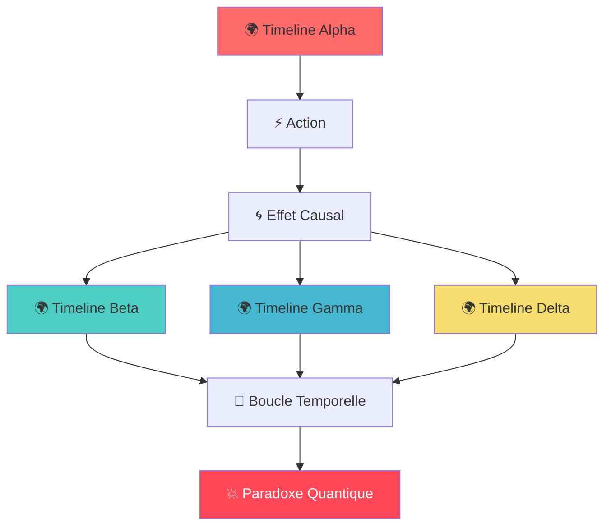

# 🌌 ChronoShift: The Web Paradox

<div align="center">

```ascii
╔═══════════════════════════════════════════════════════════════════════════════════╗
║                                                                                   ║
║     ██████╗██╗  ██╗██████╗  ██████╗ ███╗   ██╗ ██████╗ ███████╗██╗  ██╗██╗████████╗ ║
║    ██╔════╝██║  ██║██╔══██╗██╔═══██╗████╗  ██║██╔═══██╗██╔════╝██║  ██║██║╚══██╔══╝ ║
║    ██║     ███████║██████╔╝██║   ██║██╔██╗ ██║██║   ██║███████╗███████║██║   ██║    ║
║    ██║     ██╔══██║██╔══██╗██║   ██║██║╚██╗██║██║   ██║╚════██║██╔══██║██║   ██║    ║
║    ╚██████╗██║  ██║██║  ██║╚██████╔╝██║ ╚████║╚██████╔╝███████║██║  ██║██║   ██║    ║
║     ╚═════╝╚═╝  ╚═╝╚═╝  ╚═╝ ╚═════╝ ╚═╝  ╚═══╝ ╚═════╝ ╚══════╝╚═╝  ╚═╝╚═╝   ╚═╝    ║
║                                                                                   ║
║                     🌟 THE WEB PARADOX 🌟                                        ║
║                                                                                   ║
╚═══════════════════════════════════════════════════════════════════════════════════╝
```

[](https://github.com/chronoshift/web-paradox)
[](https://status.chronoshift.dev)
[](https://reality.chronoshift.dev)
[](https://docs.chronoshift.dev/paradox-protocol)

**Un jeu de puzzle/action multiversel révolutionnaire qui repousse les limites du possible dans un navigateur web.**

[🎮 Jouer Maintenant](#-installation-rapide) • [📖 Documentation](#-documentation) • [🔧 API](#-api-avancée) • [🚨 Avertissements](#-avertissements-temporels)

</div>

---

## 🌟 Vue d'ensemble

**ChronoShift: The Web Paradox** est un jeu expérimental qui transforme votre navigateur en machine à voyager dans le temps. Contrôlez plusieurs versions de vous-même à travers des timelines parallèles, résolvez des puzzles interdimensionnels et naviguez dans les paradoxes temporels les plus complexes jamais créés.

### 🎯 Concept Révolutionnaire



## ✨ Fonctionnalités Épiques

### 🎮 Core Gameplay
- 🔄 **Contrôle Multi-Timeline** : Gérez 4 versions de vous simultanément
- ⚡ **Synchronisation Temps Réel** : WebSocket pour coordination parfaite
- 🧩 **Puzzles Causaux** : Actions dans une timeline affectent les autres
- 🌀 **Physique Quantique** : Chaque monde a ses propres lois physiques

### 🔥 Fonctionnalités Avancées
- 🛠️ **Console de Débogage Intégrée** : Mode développeur immersif
- 🎨 **Interface Meta** : Le jeu "hacke" votre navigateur
- 👁️ **IA Observatrice** : Système qui apprend et s'adapte
- 💾 **Système de Rollback** : Version control façon Git pour timelines

## 🚀 Installation Rapide

### Prérequis
```bash
Node.js ≥ 18.0.0
Chrome/Firefox dernière version
16GB RAM minimum (pour les calculs quantiques)
Connexion stable (synchronisation temps réel)
```

### Installation Lightning ⚡
```bash
# Clone le multiverse
git clone https://github.com/chronoshift/web-paradox.git
cd chronoshift-web-paradox

# Installation des dépendances quantiques
npm install --temporal-mode

# Démarrage du serveur temporel
npm run dev:multiverse

# Ouverture du portail dimensionnel
open http://localhost:3000/timeline/alpha
```

### Installation Docker (Recommandé)
```dockerfile
# Utilise l'image temporelle optimisée
FROM chronoshift/quantum-node:18-temporal

WORKDIR /app/multiverse
COPY . .

# Variables d'environnement quantiques
ENV REALITY_INDEX=97.3
ENV PARADOX_TOLERANCE=HIGH
ENV QUANTUM_CORES=4

RUN npm ci --only=production
EXPOSE 3000 8080 9000 9001

# Démarre tous les serveurs timeline
CMD ["npm", "run", "start:all-timelines"]
```

## 🎮 Guide de Survie

### Contrôles de Base
```
🎹 CONTRÔLES UNIVERSELS
├── WASD / ↑↓←→  : Déplacement multi-dimensionnel
├── SPACE        : Interaction avec objets temporels
├── F12          : Console quantique (MODE DEV)
├── ESC          : Pause temporelle d'urgence
├── ALT+TAB      : Switch entre timelines
└── CTRL+Z       : Rollback temporel (si disponible)

⚠️  CONTRÔLES SECRETS
├── KONAMI CODE  : Active le mode God
├── ALT+F4       : Reset paradoxe critique
└── F1+F1+F1     : Mode spectateur quantique
```

### Mécaniques Avancées

#### 🌀 Système de Causalité
```javascript
// Exemple de relation causale complexe
const CausalMatrix = {
  'Alpha→Beta': { delay: 100ms, strength: 0.8 },
  'Beta→Gamma': { delay: 200ms, strength: 0.6, inverse: true },
  'Gamma→Delta': { delay: 150ms, strength: 1.0, quantum: true },
  'Delta→Alpha': { delay: 300ms, strength: 0.4, paradox_risk: 'HIGH' }
};
```

#### ⚡ Gestion des Paradoxes
```
🚨 NIVEAUX DE PARADOXE
├── 🟢 STABLE (0-2)   : Réalité cohérente
├── 🟡 INSTABLE (3-5) : Fluctuations mineures
├── 🟠 CRITIQUE (6-8) : Risque de collapse
└── 🔴 CHAOS (9+)     : Destruction imminente
```

## 🔧 API Avancée

### WebSocket Real-Time API
```javascript
// Connexion au serveur temporel
const chronoSocket = new WebSocket('wss://api.chronoshift.dev/v2/temporal');

// Écoute des événements quantiques
chronoSocket.on('timeline.sync', (data) => {
  console.log(`Timeline ${data.id} synchronized at ${data.timestamp}`);
});

chronoSocket.on('paradox.detected', (event) => {
  handleParadox(event.severity, event.affected_timelines);
});

// Envoi d'actions cross-timeline
function sendAction(timeline, action, data) {
  chronoSocket.emit('timeline.action', {
    source: timeline,
    type: action,
    payload: data,
    timestamp: Date.now(),
    reality_check: calculateRealityIndex()
  });
}
```

### REST API pour développeurs
```bash
# Obtenir l'état global du multiverse
GET /api/v2/multiverse/status
{
  "reality_index": 97.3,
  "active_timelines": 4,
  "paradox_level": 2,
  "sync_rate": 98.7,
  "quantum_stability": "NOMINAL"
}

# Créer une nouvelle timeline
POST /api/v2/timelines
{
  "name": "Timeline-Epsilon",
  "physics": "inverted_gravity",
  "time_dilation": 1.5,
  "reality_anchor": false
}

# Rollback temporel d'urgence
POST /api/v2/emergency/rollback
{
  "target_timestamp": "2024-03-15T14:30:00Z",
  "preserve_memories": true,
  "force_sync": true
}
```

## 🛠️ Configuration Avancée

### Variables d'Environnement
```env
# Configuration Serveur
CHRONOSHIFT_MODE=production
TEMPORAL_PRECISION=microseconds
QUANTUM_THREADS=8
REALITY_VALIDATION=strict

# Sécurité Temporelle
PARADOX_AUTO_RESOLVE=true
MAX_TIMELINE_DEPTH=10
CAUSALITY_CHECKS=enabled
BOOTSTRAP_PARADOX_PREVENTION=true

# Performance
SYNC_RATE_LIMIT=120hz
PREDICTION_BUFFER=500ms
QUANTUM_CACHE_SIZE=2GB
TIMELINE_PRELOAD=3
```

### Fichier de Configuration Quantique
```yaml
# chronoshift.config.yaml
multiverse:
  timelines:
    alpha:
      physics: "standard"
      gravity: 1.0
      time_flow: 1.0
      reality_index: 100
    beta:
      physics: "mirror"
      gravity: -0.8
      time_flow: 0.9
      reality_index: 94
    gamma:
      physics: "quantum"
      gravity: 0.3
      time_flow: 1.2
      reality_index: 87
    delta:
      physics: "chaos"
      gravity: "random"
      time_flow: 2.0
      reality_index: 76

causality:
  max_loops: 5
  auto_resolve: true
  paradox_threshold: 0.85
  
security:
  bootstrap_protection: true
  grandfather_paradox_guard: true
  information_paradox_handler: "quantum_decoherence"
```

## 📊 Métriques & Monitoring

### Dashboard Temps Réel
```bash
# Installation du monitoring quantique
npm install -g @chronoshift/quantum-monitor

# Lancement du dashboard
chronoshift-monitor --timeline=all --metrics=advanced
```

### Métriques Critiques
- **Reality Index** : Cohérence de la réalité (>90% recommandé)
- **Sync Rate** : Taux de synchronisation inter-timeline
- **Paradox Level** : Niveau de risque temporel
- **Quantum Stability** : Stabilité des fluctuations quantiques
- **Causal Loops** : Nombre de boucles temporelles actives

## 🚨 Avertissements Temporels

### ⚠️ Risques Connus
```
🔥 ATTENTION EXTRÊME REQUISE
├── Paradoxes temporels peuvent affecter la réalité locale
├── Boucles causales peuvent créer des effets de déjà-vu
├── Exposition prolongée peut causer des vertiges temporels
├── Ne pas jouer pendant plus de 4h consécutives
└── Arrêter immédiatement si vous voyez des versions multiples de vous-même
```

### 🛡️ Protocoles de Sécurité
1. **Sauvegarde Automatique** : État sauvé toutes les 30 secondes
2. **Rollback d'Urgence** : CTRL+ALT+R pour reset complet
3. **Détection de Paradoxe** : Arrêt automatique si risque critique
4. **Mode Sans Échec** : Démarrage avec une seule timeline

### 🔧 Dépannage Quantique

#### Problèmes Fréquents
```bash
# Timeline désynchronisée
chronoshift fix --sync-all-timelines

# Paradoxe bloquant
chronoshift emergency --reset-causality

# Performance dégradée
chronoshift optimize --quantum-cleanup

# Réalité corrompue
chronoshift restore --last-stable-reality
```

## 🌟 Roadmap Temporelle

### 📅 Version 3.0 "Quantum Entanglement" (Q3 2024)
- [ ] 🌐 Multi-navigateur synchronisé (Chrome + Firefox + Safari)
- [ ] 🤖 IA adaptive qui apprend du comportement joueur
- [ ] 🎨 Éditeur de timeline custom
- [ ] 🏆 Mode compétitif multijoueur
- [ ] 🔊 Audio spatial 3D avec effets Doppler temporels

### 📅 Version 4.0 "Reality Breach" (2025)
- [ ] 🕳️ Portails inter-dimensionnels
- [ ] 📱 Support mobile avec contrôles gestuels
- [ ] 🧠 Interface neuronale expérimentale
- [ ] 🌌 Génération procédurale d'univers
- [ ] ⚛️ Physique quantique complète

## 👥 Équipe & Contributions

### 🏆 Core Team "Les Voyageurs Temporels"
- **Dr. Sarah Chen** - Architecte Quantique Principal 🧠
- **Marcus "TimeLoop" Rodriguez** - Lead Developer 💻
- **Aria Nakamura** - UX/UI Designer Dimensionnelle 🎨
- **Prof. James Fitzgerald** - Consultant Physique Théorique ⚗️

### 🤝 Comment Contribuer
```bash
# Fork et clone
git clone https://github.com/your-username/chronoshift-web-paradox.git

# Créer une branche temporelle
git checkout -b timeline/ma-nouvelle-fonctionnalité

# Développement avec tests quantiques
npm run test:quantum
npm run test:causality
npm run test:paradox-scenarios

# Commit avec message temporel
git commit -m "feat(timeline): ajoute support gravity inversée

- Implémentation physique miroir pour Timeline Beta
- Tests de régression causale
- Documentation API mise à jour

Refs: #142, #158
Tested-on: Chrome 91+, Firefox 89+
Reality-Index: 94.7% (stable)"
```

### 🎯 Areas où nous avons besoin d'aide
- 🔧 **Performance Optimization** : WebGL shaders pour effets quantiques
- 🧪 **Physics Simulation** : Moteurs physique custom par timeline
- 🎨 **Visual Effects** : Particules, shaders, post-processing
- 📝 **Documentation** : Guides utilisateur multilingues
- 🧪 **QA Testing** : Scénarios paradoxe edge-cases

## 📚 Documentation Complète

### 📖 Liens Utiles
- [🏠 Site Officiel](https://chronoshift.dev)
- [📚 Documentation API](https://docs.chronoshift.dev)
- [🎮 Guides de Jeu](https://guides.chronoshift.dev)
- [🔬 Articles Scientifiques](https://research.chronoshift.dev)
- [💬 Community Discord](https://discord.gg/chronoshift)
- [🐛 Bug Reports](https://github.com/chronoshift/web-paradox/issues)


## ⚖️ Licence & Avertissements Légaux

```
MIT License avec Clause Temporelle

Copyright (c) 2024 ChronoShift Interactive Labs

Permission est accordée, gratuitement, à toute personne obtenant une copie
de ce logiciel et des fichiers de documentation associés (le "Logiciel"),
de traiter dans le Logiciel sans restriction, y compris sans limitation
les droits d'utiliser, copier, modifier, fusionner, publier, distribuer,
sous-licencier, et/ou vendre des copies du Logiciel...

CLAUSE SPÉCIALE TEMPORELLE:
L'utilisation de ce logiciel pour créer des paradoxes temporels réels
est strictement interdite. Les développeurs ne sont pas responsables
des dommages causés à la chronologie universelle.
```

---

<div align="center">

```
╔═══════════════════════════════════════════════════════════════════════════════════╗
║                                                                                   ║
║    🌌 "Le temps n'est qu'une illusion. ChronoShift est la réalité." 🌌           ║
║                                                                                   ║
║                        — Dr. Sarah Chen, Architecte Quantique                    ║
║                                                                                   ║
╚═══════════════════════════════════════════════════════════════════════════════════╝
```

**⭐ Si ce projet vous a fait voyager dans le temps, n'oubliez pas de laisser une étoile ! ⭐**

[](https://github.com/chronoshift/web-paradox)
[](https://twitter.com/chronoshift_dev)

</div>
